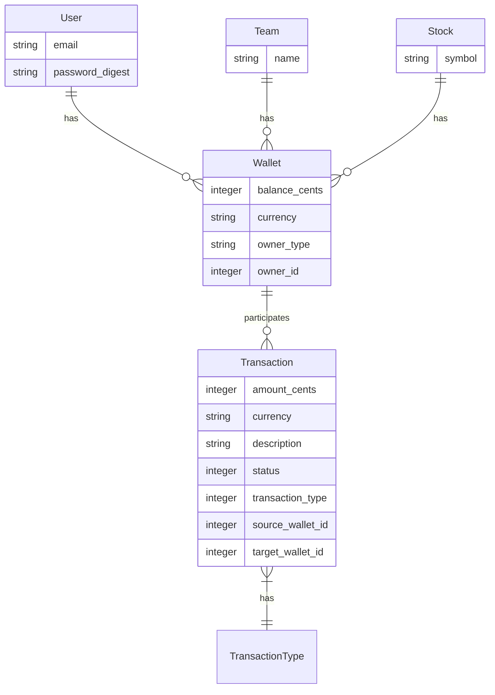
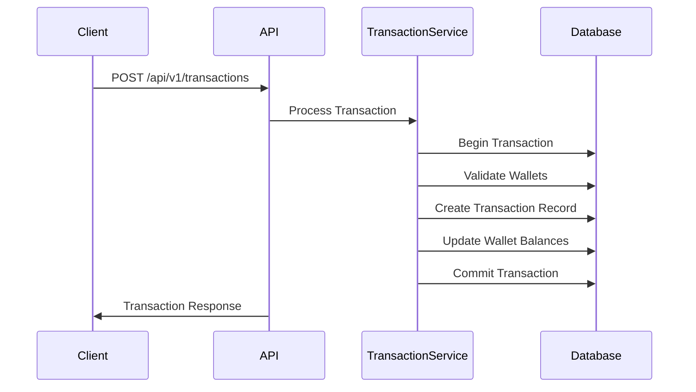

# Internal Wallet Transaction System API

A robust internal wallet system that enables financial transactions between different entities (Users, Teams, Stocks) with proper validations and ACID compliance.

## 📊 System Architecture

### Entity Relationship Diagram


### Transaction Flow Diagram


## 🚀 Features

- Multi-entity wallet system (Users, Teams, Stocks)
- Secure JWT-based authentication
- ACID-compliant transactions
- Real-time stock price integration
- Balance tracking and transaction history
- Multi-currency support with exchange rates
- RESTful API design

## 📋 Requirements

- Ruby 3.2.0+
- Rails 7.1.0+
- PostgreSQL 12+
- RapidAPI Key (for stock price integration)

## 🛠 Installation & Setup

1. Clone the repository
```bash
git clone https://github.com/yourusername/wallet-system.git
```


2. Install dependencies
```bash

bundle install
```

3. Setup database
```bash

rails db:create db:migrate
```


4. Set environment variables
```bash

RAPIDAPI_KEY=your_rapid_api_key
```


5. Start the server
```bash

rails server
```


## 🔑 API Documentation

### Authentication

The system uses a custom token-based authentication (not JWT). Include the token in the Authorization header:
```
Authorization: Bearer user_id:expiration:signature
```

#### Endpoints:

**Login**
```
POST /api/v1/session
Content-Type: application/json

{
  "email": "user@example.com",
  "password": "password123"
}

Response:
{
  "token": "1:1703894400:a1b2c3...",
  "user": {
    "id": 1,
    "email": "user@example.com"
  }
}
```

**Logout**
```
DELETE /api/v1/session
Authorization: Bearer <token>
```

### Wallet Operations

**Get Wallet Details**
```
GET /api/v1/wallets/:id
Authorization: Bearer <token>

Response:
{
  "data": {
    "id": 1,
    "balance": {
      "amount": 1000.00,
      "currency": "USD"
    }
  }
}
```

**Get Wallet Balance**
```
GET /api/v1/wallets/:id/balance
Authorization: Bearer <token>

Response:
{
  "data": {
    "balance": {
      "amount": 1000.00,
      "currency": "USD"
    }
  }
}
```

### Transaction Operations

**Create Transaction**
```
POST /api/v1/transactions
Authorization: Bearer <token>
Content-Type: application/json

{
  "type": "transfer",
  "amount": 100.50,
  "currency": "USD",
  "target_wallet_id": 123,
  "description": "Payment for services"
}

Response:
{
  "data": {
    "id": 1,
    "amount": {
      "amount": 100.50,
      "currency": "USD"
    },
    "status": "completed",
    "transaction_type": "transfer",
    "description": "Payment for services",
    "source_wallet_id": 1,
    "target_wallet_id": 123,
    "created_at": "2024-01-01T12:00:00Z"
  }
}
```

**Get Transaction History**
```
GET /api/v1/transactions
Authorization: Bearer <token>

Response:
{
  "data": {
    "transactions": [
      {
        "id": 1,
        "amount": {
          "amount": 100.50,
          "currency": "USD"
        },
        "status": "completed",
        "transaction_type": "transfer",
        "description": "Payment for services",
        "source_wallet_id": 1,
        "target_wallet_id": 123,
        "created_at": "2024-01-01T12:00:00Z"
      }
    ]
  }
}
```

### Stock Operations

**Get Single Stock Price**
```
GET /api/v1/stocks/price?symbol=AAPL
Authorization: Bearer <token>

Response:
{
  "data": {
    "symbol": "AAPL",
    "price": 150.25,
    "currency": "USD"
  }
}
```

**Get Multiple Stock Prices**
```
GET /api/v1/stocks/prices?symbols[]=AAPL&symbols[]=GOOGL
Authorization: Bearer <token>

Response:
{
  "data": [
    {
      "symbol": "AAPL",
      "price": 150.25,
      "currency": "USD"
    },
    {
      "symbol": "GOOGL",
      "price": 2750.50,
      "currency": "USD"
    }
  ]
}
```

**Get All Stock Prices**
```
GET /api/v1/stocks/price_all
Authorization: Bearer <token>

Response:
{
  "data": [
    {
      "symbol": "AAPL",
      "price": 150.25,
      "currency": "USD"
    },
    // ... more stocks
  ]
}
```

### Error Responses

All endpoints return appropriate HTTP status codes:
```
401 Unauthorized
{
  "error": "Unauthorized"
}

422 Unprocessable Entity
{
  "error": "Detailed error message"
}

500 Internal Server Error
{
  "error": "Internal server error"
}
```

## 💰 Transaction Types & Business Rules

1. **Transfer**
   - Move money between two wallets
   - Requires source and target wallets
   - Same currency validation

2. **Deposit**
   - Add money to a wallet
   - Only requires target wallet
   - Creates credit transaction

3. **Withdraw**
   - Remove money from a wallet
   - Only requires source wallet
   - Creates debit transaction

### Types
- `Transfer`: Move money between two wallets
- `Deposit`: Add money to a wallet
- `Withdraw`: Remove money from a wallet

### Validation Rules
1. Amount must be positive
2. Transaction must occur during business hours (9 AM - 5 PM)
3. Maximum transaction limit: $1,000,000
4. Source wallet must have sufficient funds
5. Currencies must match for transfers
6. Proper wallet validation based on transaction type

## 🏗 Architecture & Implementation

### Core Components
1. **HasWallet Concern**: Adds wallet functionality to models
2. **Transaction Types**: STI implementation for different transaction types
3. **WalletTransactionService**: Handles ACID-compliant transactions
4. **LatestStockPrice Library**: Stock price integration

### Database Schema
```ruby
create_table "wallets", force: :cascade do |t|
  t.references :owner, polymorphic: true, null: false
  t.integer :balance_cents, default: 0, null: false
  t.string :currency, null: false
  t.timestamps
end

create_table "transactions", force: :cascade do |t|
  t.references :source_wallet
  t.references :target_wallet
  t.integer :amount_cents, null: false
  t.string :currency, null: false
  t.timestamps
end
```

## 🧪 Testing

### Running Tests
```bash
bundle exec rspec
```

### Test Coverage
- Model validations
- Transaction business rules
- API endpoints
- Integration tests
- Stock price integration

## 🔒 Security Considerations

- Session-based authentication
- CSRF protection
- Database transaction locks
- Input validation
- Error handling

## 📦 Dependencies

- `money-rails`: Money and currency handling
- `bcrypt`: Password encryption
- `httparty`: API integration
- `rspec-rails`: Testing framework

## 🚧 Error Handling

The API returns appropriate HTTP status codes:
- 200: Success
- 401: Unauthorized
- 422: Unprocessable Entity
- 500: Server Error

Error responses include descriptive messages:
```json
{
  "error": "Detailed error message"
}
```

## 🤝 Contributing

1. Fork the repository
2. Create your feature branch (`git checkout -b feature/amazing-feature`)
3. Commit your changes (`git commit -m 'Add amazing feature'`)
4. Push to the branch (`git push origin feature/amazing-feature`)
5. Open a Pull Request

## 📝 License & Authors

This project is licensed under the MIT License - see the [LICENSE.md](LICENSE.md) file for details.

- Irvan - Initial work - [Irvan](https://github.com/mr-vero)

## 🙏 Acknowledgments

- RapidAPI for stock price data
- Money gem contributors
- Rails community

## 📚 Additional Resources

1. [API Documentation](API_DOCUMENTATION.md)
2. [Postman Collection](WalletSystem.postman_collection.json)
3. [Development Guide](DEVELOPMENT.md)
```

This README provides:
- Clear installation instructions
- Comprehensive API documentation
- Architecture overview
- Testing instructions
- Security considerations
- Contribution guidelines

